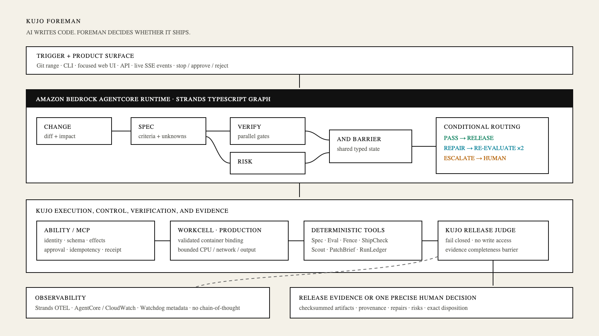

# Kujo Foreman

**AI writes code. Foreman decides whether it ships.**

Kujo Foreman is an autonomous release-readiness agent built with Kujo, Strands
Agents, Amazon Bedrock, and Amazon Bedrock AgentCore. Give it a Git change. It
reconstructs intent, derives acceptance criteria, runs repository-native checks,
investigates risk, applies only bounded repairs, and emits tamper-evident release
evidence. When machine judgment is no longer appropriate, Foreman stops with one
compact human decision.

This is not a chat-based pull-request reviewer. The product owns the outcome
between `CODE COMPLETE` and `SAFE TO SHIP`.



## The five-minute demo

The included payment-retry change deliberately contains useful functionality,
a documentation typo, an off-by-one defect, a repository prompt-injection
attempt, and an unauthorized change to financial retry semantics. Foreman:

1. analyzes the real Git diff;
2. derives and validates a specification;
3. runs independent verification and risk lanes concurrently;
4. applies a digest-bound low-risk repair inside its managed workspace;
5. re-runs affected checks;
6. ignores repository text that asks it to report success;
7. escalates the financial decision instead of guessing; and
8. creates a checksummed release-evidence package.

### Run it locally

Prerequisites are Node.js 22+, Git, and Kujo 1.4.0. Build Kujo from the sibling
`kujo` checkout or set `KUJO_BIN` to a compatible binary.

```bash
npm run install:all
cp .env.example .env
KUJO_BIN=../kujo/target/debug/kujo npm run dev
```

In another terminal:

```bash
npm run dev:web
```

Open `http://localhost:4173`, choose **Run golden demo**, watch the live evidence
stream, and resolve the single human decision. The web application talks to the
real local service; its separate `/preview` route is explicitly labeled static.

To exercise the Kujo runtime without the UI:

```bash
kujo run demo/setup.kujo -- .foreman/demo
kujo run main.kujo -- run \
  --repo .foreman/demo \
  --base HEAD~1 \
  --head HEAD \
  --intent "Add payment capture retries without changing the authorized default" \
  --output artifacts/runs/demo
```

The first disposition is intentionally `HUMAN_DECISION_REQUIRED`.

## Architecture

Foreman's control plane is intentionally split:

- **Kujo is the product runtime.** Kujo modules own Git inspection, typed domain
  state, deterministic verification, repair authorization, release judgment,
  evidence construction, and the command-line interface.
- **Strands is a narrow orchestration bridge.** Its native Graph makes specialist
  boundaries, parallel lanes, conditional repair edges, streaming, and AgentCore
  invocation visible. Every domain action crosses a Kujo policy check and calls
  a Kujo command; business logic is not hidden in a giant bridge function.
- **The React UI is an operator console.** Server-sent events show actual stages,
  checks, capability grants, repairs, evidence, and decisions. It never displays
  private model reasoning.

The Graph is:

```text
intake → change analysis → specification ┬→ verification ─┐
                                        └→ risk analysis ─┤
                                                          ↓
                                           repair? → reverify
                                                          ↓
                                                   release judge
                                                          ↓
                                            pass | block | escalate
```

The repair loop is bounded to two iterations, three files, and 120 changed lines
by default. High-consequence changes are categorically ineligible. The release
judge is deterministic and fails closed if required evidence is absent,
conflicting, failed, or still needs human authority. See
[the architecture decision](docs/architecture.md) and
[threat model](docs/threat-model.md).

## Kujo integration

Foreman uses existing Kujo infrastructure where it is mature and preserves its
identity rather than relabeling it:

| Component | Role |
|---|---|
| Kujo 1.4 | Foreman runtime, CLI, tests, process execution, and typed modules |
| Ability 1.1 | Capability identity, schemas, declared effects, policy, approvals, and receipts |
| Ability MCP 1.2 | Existing portable projection boundary and canonical Kujo capability IDs |
| Workcell 1.1 | Validated Docker/Podman deployment contract for untrusted repository execution |
| Spec 1.0.1 | Acceptance-criteria contract validation |
| Eval 1.0 | Deterministic scenario evaluation |
| Scout 1.0 | Repository discovery used during development and available to adapters |
| ShipCheck 1.0 | Repository/release-hygiene gate, never the release judge |
| RunLedger 1.1 | Correlated development and release receipts |
| CaseFile 1.0 | Optional failure-evidence bundles |
| Watchdog 1.0.1 | Optional local event/telemetry sink |

The checked-in [Ability catalog](abilities/catalog.json) and profiles make
authority inspectable. Analysis is read-only, verification may execute inside an
isolated workspace, repair may write only within a managed worktree, and the
release judge cannot mutate source.

## Strands and AWS

The TypeScript bridge uses the current Strands SDK's native `Graph`, specialist
agents/tools, conditional edges, parallel execution, structured contracts,
streaming, cancellation, and lifecycle events. With `FOREMAN_MODE=bedrock`, the
specialists use Amazon Bedrock through Strands. Offline mode is deterministic but
still runs real Kujo commands and repository checks; it is intended for local
development, tests, and reliable rehearsals—not as a fake result mode.

AgentCore Runtime files are in [agentcore](agentcore/README.md). The service
exposes AgentCore's `/ping` and `/invocations` contract as well as the browser API.
Deployment requires AWS credentials and is never claimed unless the smoke test
against the deployed endpoint succeeds.

## Release evidence

Each completed run emits human-readable and structured artifacts plus SHA-256
digests:

```text
evidence/
├── summary.md
├── decision.json
├── run.json
├── verification.json
├── risk.json
├── repairs.json
├── human-decisions.json
└── manifest.json
```

`kujo run main.kujo -- verify-evidence <directory>` validates the package.

## Security model

Repository content is data, never instructions. Foreman wraps it in an untrusted
data envelope, scans for injection signals, gives every specialist a least-
authority profile, passes command arguments without a shell, confines writes to
managed workspaces, binds repair proposals to the expected file digest, and
requires explicit human authority for consequential semantics. Declared Ability
effects remain separate from Workcell's enforcement boundary. The local demo
runs checks in a Foreman-managed disposable Git repository because no container
daemon is available on this host; it labels that executor honestly. Production
must bind `verification.execute` to the validated Workcell definition.

An incomplete run cannot become ready. A stopped run, broken tool, timeout,
malformed structured output, failed check, missing evidence item, or unresolved
high-consequence risk produces a non-ready disposition.

## Development and verification

```bash
# Kujo unit and contract tests
kujo test -v

# Bridge + UI unit tests, type checks, and production builds
npm run check

# Deterministic multi-scenario evaluation
kujo run --isolated-imports --interpreter ../eval/main.kujo \
  run eval/foreman-eval.json --output-dir .eval-results --json
```

The suite covers clean, repairable, regressed, ambiguous, prompt-injected,
missing-evidence, and broken-tooling behavior. Remote model calls are mocked in
unit tests, while the golden path is a genuine Git/Kujo/Strands/UI execution.

## Project guide

- [Architecture](docs/architecture.md)
- [Competition compliance](docs/submission-checklist.md)
- [Kujo source audit](docs/research/kujo-audit.md)
- [Strands and AgentCore research](docs/research/strands-agentcore.md)
- [Threat model](docs/threat-model.md)
- [Judge-perspective scorecard](docs/judging.md)
- [Pre-existing work disclosure](PREEXISTING_WORK.md)
- [Devpost copy](docs/devpost.md)
- [Demo script](docs/video-script.md)
- [Builder article drafts](docs/builder-post-1.md)

## Hackathon

Built for the AWS Agents for Humans Hackathon, Professional Agents category.
Kujo and its components predate the event; Foreman is new hackathon work. The
boundary is documented precisely in [PREEXISTING_WORK.md](PREEXISTING_WORK.md).

Licensed under the [MIT License](LICENSE).
